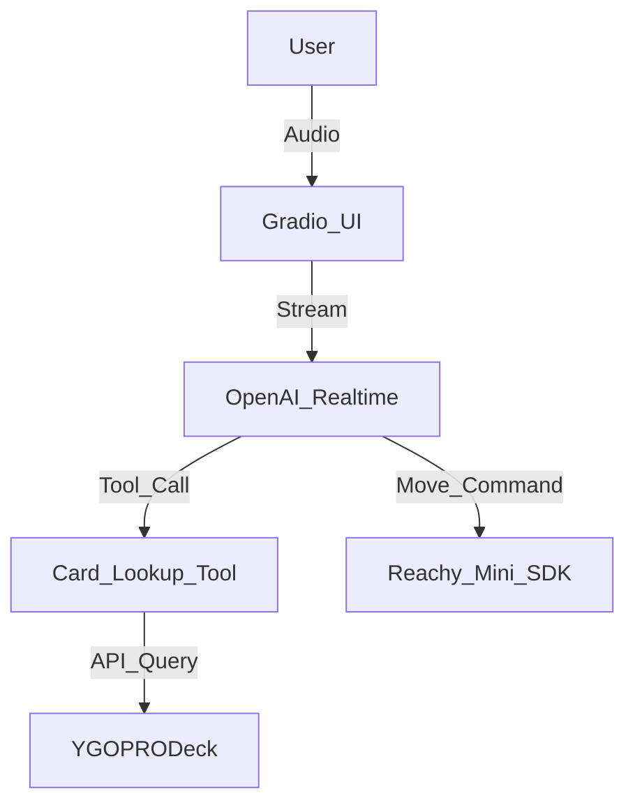

# 🃏 Reachy Mini: Yu-Gi-Oh! Card Expert

A conversational Yu-Gi-Oh! card identification and strategy app for the Reachy Mini robot. This app uses the OpenAI Realtime API to provide a seamless, low-latency "Duelist Expert" personality that can identify physical cards via the robot's camera and look up detailed stats from the YGOPRODeck database.


## ✨ Features

- **Visual Identification**: Show any Yu-Gi-Oh! card to Reachy's camera, and it will identify it using vision.
- **Real-time Lookup**: Integrated with the [YGOPRODeck API](https://db.ygoprodeck.com/api-guide/) to fetch card effects, sets, and archetypes.
- **Pro Duelist Personality**: A custom-tuned personality that provides concise, punchy advice on deck synergy.
- **Low Latency**: Built on the OpenAI Realtime API for fluid, natural voice conversation.
- **Hardware Integration**: Fully compatible with Reachy Mini's head movements, head wobbling (audio-sync), and expressive emotions.

## 🚀 Getting Started

### 1. Installation

Clone this repository and install the dependencies:

```bash
git clone https://github.com/chinesco/yugioh-parser.git
cd yugioh-parser/yugioh_reader
python3 -m venv .venv
source .venv/bin/activate
pip install -e .
```

### 2. OpenAI API Key

You need an OpenAI API key with access to the Realtime API. 
Create a `.env` file in the `yugioh_reader/` folder:

```bash
OPENAI_API_KEY=sk-your-key-here
```

### 3. Running on the Robot

To run the app with the Gradio web interface (recommended for visual feedback):

```bash
python3 src/yugioh_reader/main.py --gradio
```

### 🔒 Microphone Access (SSH Tunneling)

Modern browsers block microphone access on insecure (HTTP) origins. To use your laptop's microphone with the robot, use **SSH Port Forwarding**:

1.  Close your current SSH session.
2.  Connect using the tunnel command:
    ```bash
    ssh -L 7860:localhost:7860 pollen@<ROBOT_IP>
    ```
3.  Access the app at: **http://localhost:7860/chat**

## 🛠️ Customization

### Personality & Instructions
The "Duelist Expert" logic lives in:
`src/yugioh_reader/profiles/_yugioh_reader_locked_profile/instructions.txt`

### Custom Tools
The card lookup tool is implemented in:
`src/yugioh_reader/profiles/_yugioh_reader_locked_profile/custom_tool.py`

## 🏗️ Architecture

The app follows the standard Reachy Mini Conversation App architecture, with a custom profile-locked toolset.



## 📄 License

This project is licensed under the Apache 2.0 License - see the LICENSE file for details.